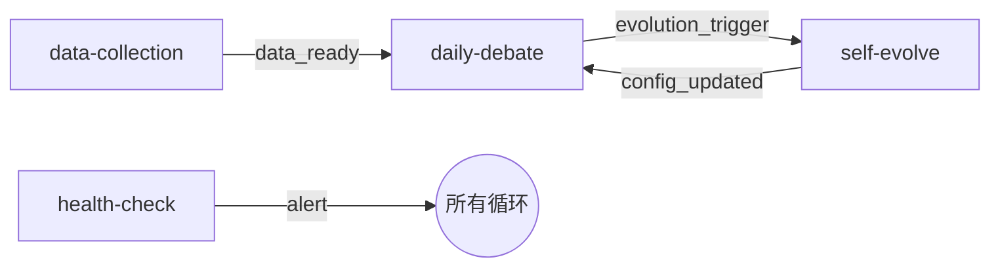

# G22: 多循环协作协议设计文档

> **版本**: v0.1 (设计草案)
> **日期**: 2026-07-20
> **关联**: FDT Loop Contract 规范

## 1. 问题陈述

FDT 当前有 5 个自动化循环（daily-debate / self-evolve / data-collection / ml-training / health-check），各循环之间通过**文件系统和 PG 表间接协作**，缺乏显式的 handoff 协议和背压机制。

**问题**：
- 数据依赖关系隐性化 — "data-collection 完成了没有？"无法程序化判断
- 没有流控 — self-evolve 可能同时被 data-collection 和 daily-debate 触发
- 故障隔离困难 — 一个循环卡住会影响其他循环的 state 判断

## 2. 设计目标

1. **显式化协作**：循环间通过 handoff 消息通信，不共享 state
2. **流控与背压**：避免消费者被生产者压垮
3. **可观测性**：任意时刻可查看所有 handoff 的状态

## 3. Handoff 消息设计

### 3.1 Pydantic Schema

```python
from pydantic import BaseModel
from datetime import datetime

class HandoffMessage(BaseModel):
    id: str
    producer_loop: str               # 产生此消息的循环
    consumer_loop: str               # 目标消费循环
    type: str                        # data_ready, evolution_complete, alert, signal_ready
    payload: dict                    # 具体数据
    priority: int = 0                # 0=normal, 1=high, 2=critical
    created_at: datetime
    claimed_at: datetime | None = None
    completed_at: datetime | None = None
    status: str = "pending"          # pending / claimed / done / failed / archived
    ttl_seconds: int = 7200          # 默认 2 小时
    error_message: str | None = None
    trace_id: str | None = None
```

### 3.2 状态机

```
    created
       │
       ▼
   ┌────────┐
   │ pending │ ◄──── 消费者可以认领
   └───┬────┘
       │ claimed
       ▼
   ┌────────┐
   │ claimed│ ◄──── 消费者正在处理
   └───┬────┘
      / \
 done/   \failed
    ▼     ▼
  ┌────┐ ┌──────┐
  │done│ │failed│
  └────┘ └──────┘
     │       │
     ▼       ▼
  ┌────────┐
  │archived│
  └────────┘

  TTL 过期时，pending/claimed 自动→archived(stale)
```

### 3.3 目录结构

```
memory/handoff/
├── data-collection_to_daily-debate/
│   └── {msg_id}.json
├── daily-debate_to_self-evolve/
│   └── {msg_id}.json
└── self-evolve_to_daily-debate/
    └── {msg_id}.json
```

## 4. 背压机制

### 4.1 三级策略

| 级别 | 条件 | 动作 |
|:----:|------|------|
| **限产** | 在途 handoff ≥ max_inflight | 生产者暂停，等待至少一个被消费 |
| **提效** | 在途积压超过 warning_threshold | 提高消费循环频率或并行度 |
| **降级** | handoff 超过 ttl 未被处理 | 自动标记为 stale，释放消费能力 |

### 4.2 配置项

```yaml
# 每个循环在 contract.yaml 中配置
handoff:
  max_inflight: 5                  # 最大在途 handoff 数
  stale_threshold_minutes: 120     # 超时阈值（分钟）
  consumer_poll_interval: 60       # 消费者轮询间隔（秒）
```

## 5. 循环拓扑



## 6. 实施计划

| 步骤 | 内容 | 工作量 |
|:----:|------|:------:|
| 1 | `memory/handoff/` 目录 + HandoffMessage Pydantic 模型 | 1d |
| 2 | `scripts/handoff_manager.py` 状态机实现 | 2d |
| 3 | `scripts/backpressure.py` 背压逻辑 | 1d |
| 4 | 集成到 existing loops contract.yaml | 1d |
| 5 | 测试 + 注册表文档 | 1d |

## 7. 风险与应对

| 风险 | 应对 |
|------|------|
| 文件系统 handoff 在高并发下性能不足 | 初期 max_inflight <= 5 控制；未来可迁移到 PG |
| 循环间产生死锁 | 每个 handoff 有 ttl，超时自动 stale；检测循环等待图 |
