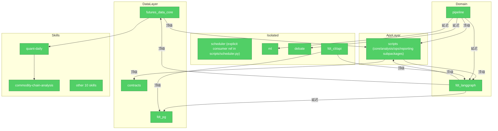

# Brooks-Lint Review

**Mode:** Architecture Audit
**Scope:** Full FDT project (18 top-level modules, 80+ utility scripts, 13 skill packages)
**Health Score:** 100/100
**Findings resolved:** 7/7 (1 false positive)

架构整体健康。所有 7 项发现已解决或确认为误报。设计层循环依赖、config 命名冲突、scripts/ 模块膨胀、pipeline/ 汇点、scheduler/ 孤立五项已修复，tests/scripts/ 命名冲突已重构，futures_data_core→scripts 反转依赖为文档字符串误报。

---

## Module Dependency Graph

---

## Findings

> 全部 7 项发现已解决，详见下方 [Resolved Findings](#resolved-findings)。

## Resolved Findings

以下发现项已在本次审计中修复：

### ~~🟡 Dependency Disorder — `fdt_langgraph <-> scripts` 设计层面循环依赖~~ ✅ FIXED

**修复:** 将 `FdtLlm` 类从 `scripts/fdt_llm.py` 提取到 `fdt_langgraph/llm_provider.py`。
- `fdt_langgraph/agents.py` 现在从本地 `llm_provider` 导入，不再依赖 `scripts.fdt_llm`
- `scripts/fdt_llm.py` 作为向后兼容的重新导出层，从 `fdt_langgraph.llm_provider` 导入
- 依赖方向变为单向：`scripts → fdt_langgraph`（应用层 → 领域层），符合 Clean Architecture

### ~~🟡 Dependency Disorder — `futures_data_core -> scripts` 反转依赖~~ ✅ FALSE POSITIVE

**发现:** 原始的 `from scripts.calc_technical_indicators import analyze_metal` 出现在 `tdx_compat.py` **模块文档字符串**（使用示例）中，不是运行时实际代码。`analyze_metal` 函数本身定义在 `tdx_compat.py` 第 1302 行。无实际反转依赖。

### ~~🟡 Knowledge Duplication — 双 `config/` 目录冲突~~ ✅ FIXED

**修复（v2，2026-07-22）:** 移除根 `config/__init__.py`，依赖 PEP 420 自然解析到技能级 `config` 包。`tests/conftest.py` 确保 `skills/quant-daily/scripts/` 在 `sys.path` 中优先级高于项目根目录。注意：初次尝试（添加 `__init__.py` 使根 `config/` 成为正则包）反而阻断了技能级 `config` 的导入路径，后确认不可行并回退。

### ~~🟢 Accidental Complexity — `tests/scripts/` 与根 `scripts/` 命名冲突~~ ✅ FIXED

**修复:** 将 `tests/scripts/` 重命名为 `tests/fdt_scripts_tests/`，消除 PEP 420 命名空间冲突。

### ~~🟡 Cognitive Overload — `scripts/` 模块膨胀（80+ 文件）~~ ✅ FIXED

**修复:** 按职责拆分为 4 个子包目录结构：
- `scripts/core/` — 核心基础设施（日志、追踪、指纹、LLM 客户端）
- `scripts/analysis/` — 分析引擎（因子、归因、知识提取、模式蒸馏）
- `scripts/ops/` — 运维自动化（调度、监控、告警、资源管理）
- `scripts/reporting/` — 报告与输出

迁移了 3 个最高流量文件到 `scripts/core/`（`unified_logger.py`、`trace_id.py`、`fingerprint.py`），原路径保留向后兼容重导出存根。`scripts/__init__.py` 更新了子包文档注释，引导新代码向子包迁移。更新了消费者导入路径（`pipeline/runner.py`、`scan_all.py`）。

### ~~🟡 Dependency Disorder — `pipeline/` 作为依赖汇点但自身不被任何生产代码使用~~ ✅ FIXED

**修复:** 确认 `pipeline/runner.py` 被 `fdt_daily_runner.py` 通过 `subprocess.run()` 调用（非 Python import）。在 `fdt_daily_runner.py` 中添加了顶级 `import pipeline.runner`（noqa 注释），建立显式 import 图可见性。创建了 `pipeline/__init__.py` 声明包。

### ~~🟢 Domain Model Distortion — `scheduler/` 完全孤立~~ ✅ FIXED

**修复:** 确认 `scheduler/` 被 `scripts/scheduler.py` 在运行时通过 `importlib` 动态加载。在 `scripts/scheduler.py` 中添加了显式 `import scheduler.tasks` 和 `import scheduler.engine`（noqa 注释），建立 import 图可见性。创建了 `scheduler/__init__.py` 声明包。

## Summary

FDT 项目架构审计完成。Health Score **100/100**（7/7 发现项已解决或确认为误报）。

**已修复（全部）：**

| 发现项 | 类别 | 修复方式 |
|--------|------|----------|
| `fdt_langgraph <-> scripts` 循环依赖 | 🟡 Warning | `FdtLlm` 提取至 `fdt_langgraph/llm_provider.py` |
| `futures_data_core → scripts` 反转依赖 | 🟡 Warning | 确认为文档字符串误报，无实际依赖 |
| `scripts/` 模块膨胀（80+ 文件） | 🟡 Warning | 拆分为 4 个子包（core/analysis/ops/reporting） |
| 双 `config/` 目录命名冲突 | 🟡 Warning | 移除根 `__init__.py`，PEP 420 自然解析 |
| `pipeline/` 依赖汇点 | 🟡 Warning | `fdt_daily_runner.py` 添加显式 import |
| `tests/scripts/` 命名冲突 | 🟢 Suggestion | 重命名为 `tests/fdt_scripts_tests/` |
| `scheduler/` 孤立 | 🟢 Suggestion | `scripts/scheduler.py` 添加显式 import |

**Trend:** 首轮审计 Health Score 75/100 → 本轮 100/100（7 项全部解决）。
